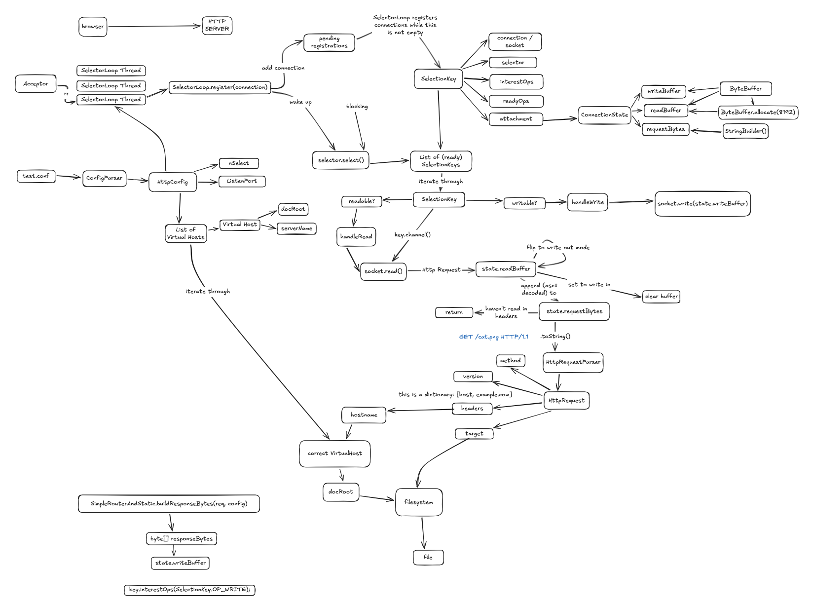
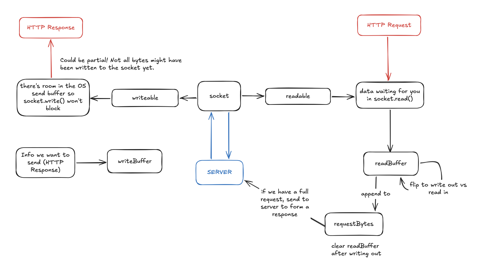

# HTTP Server

A Java HTTP/1.1 server with both a **blocking thread-pool** and a **non-blocking selector-based** I/O architecture.

## Features

- Two server architectures:
  - Blocking socket I/O using a fixed worker thread pool
  - Non-blocking Java NIO using `Selector` event loops
- HTTP/1.1 request parsing
- Persistent connections / keep-alive
- Partial request and response handling
- Request timeouts
- Virtual hosts with separate document roots
- Static file serving
- CGI execution for GET and POST requests
- Chunked transfer encoding for CGI responses
- Basic authentication using `.htaccess`
- `If-Modified-Since` / `304 Not Modified`
- `Accept` header content negotiation
- Path traversal protection
- Connection-count tracking and overload handling
- Graceful shutdown through the management console

## Architecture

Both architecture models share routing logic:

```text
                         ┌──────────────────────┐
                         │      Main.java       │
                         │ config + server init │
                         └──────────┬───────────┘
                                    │
                                    ▼
                         ┌──────────────────────┐
                         │     Acceptor.java    │
                         │ accepts connections  │
                         └───────┬───────┬──────┘
                                 │       │
                    blocking     │       │     non-blocking
                                 │       │
                                 ▼       ▼
                     ┌──────────────┐  ┌──────────────┐
                     │ ThreadWorker │  │ SelectorLoop │
                     │ fixed pool   │  │ Java NIO     │
                     └──────┬───────┘  └──────┬───────┘
                            │                 │
                            └────────┬────────┘
                                     ▼
                           ┌───────────────────┐
                           │   HttpRequest     │
                           │ parsing + headers │
                           └─────────┬─────────┘
                                     ▼
                           ┌───────────────────┐
                           │ RouterAndStatic   │
                           └──────┬──────┬─────┘
                                  │      │
                           static │      │ CGI
                                  ▼      ▼
                           filesystem  CgiHandler
```

### Blocking mode

In blocking mode (threadpool), sockets are added to an `ExecutorService` of a size specified in the config once they are accepted. Each `ThreadWorker` reads and processes requests synchronously for its connection and will continue processing requests as long as HTTP `keep-alive` is active.

### Selector mode

In selector mode, the accepted sockets are configured as non-blocking and are assigned round-robin across one or more `SelectorLoop`s.

Each of these loops is responsible for maintaining the per-connection state. When a socket is ready to read or write to, the selector will receive a Java NIO readiness notification, allowing it to switch to the appropriate socket. Incoming bytes are buffered until a complete HTTP request is available, and the response bytes can be written across multiple occurences of a socket being ready to write.

Having one selector loop manage multiple concurrent connections means that we do not need to dedicate an entire blocking worker thread to each connection.

## Request Processing

Both I/O architectures send requests to the routing layer once they have been parsed.

`RouterAndStatic`:

1. Selects the virtual host using the `Host` header.
2. Resolves the request against that host's document root.
3. Validates the requested path.
4. Handles authentication and conditional requests.
5. Serves static content or dispatches `.cgi` requests to `CgiHandler`.
6. Constructs the HTTP response.

The HTTP behavior is largely separate from the concurrency model chosen to receive and send data.

## Virtual Hosts

Multiple virtual hosts can share the same listening port while serving different document roots.

For example:

```text
Listen 6789
nSelectLoops 2

<VirtualHost *:6789>
DocumentRoot ./host1-root
ServerName host1.cs.yale.edu
</VirtualHost>

<VirtualHost *:6789>
DocumentRoot ./host2-root
ServerName host2.cs.yale.edu
</VirtualHost>
```

The `Host` header determines which document root handles the request.

## CGI

Requests ending in `.cgi` are handled by `CgiHandler`.

The server supports both `GET` and `POST` for CGI, including environment variables such as:

- `REQUEST_METHOD`
- `QUERY_STRING`
- `SERVER_NAME`
- `SCRIPT_NAME`
- `CONTENT_TYPE`
- `CONTENT_LENGTH`

POST bodies are forwarded to the CGI process through stdin.

CGI output is translated back into an HTTP/1.1 response and returned using chunked transfer encoding.

The included example CGI scripts use Perl.

## Persistent Connections and Timeouts

Both architectures support HTTP persistent connections.

After sending a response, the connection either:

- returns to request-reading state when keep-alive is active, or
- closes when requested by the client/server.

Connections can also timeout. This ensures that clients can't hold the server's resources for an extended period of time unless they are completing a request.

## Static Content

Static-file handling includes:

- MIME/content-type handling
- `Content-Length`
- `Last-Modified`
- `If-Modified-Since`
- `304 Not Modified`
- `Accept` header validation
- Basic authentication for protected resources
- directory index resolution
- path traversal protection

## Graceful Shutdown

A background management thread listens for:

```text
shutdown
```

Upon receiving the shutdown command, the server stops accepting new connections. However, it allows existing connections to finish before exiting.

## Repository Structure

```text
src/                 HTTP server implementation
tests/               HTTP request test cases
host1-root/           example document root
host2-root/           second virtual-host document root
test-http.conf        selector-mode example configuration
test-http-threads.conf
                      thread-pool example configuration
test.sh               HTTP test runner
run_all_tests.sh      assignment/regression test runner
concurrent.sh         concurrent-connection test helper
run.sh                compile-and-run helper
```

The main implementation files are:

| File | Responsibility |
| --- | --- |
| `Main.java` | Configuration, socket setup, architecture selection |
| `Acceptor.java` | Accepts and dispatches incoming connections |
| `SelectorLoop.java` | Non-blocking NIO event loop |
| `ThreadWorker.java` | Blocking connection processing |
| `HttpRequest.java` | HTTP request parsing |
| `RouterAndStatic.java` | Routing and static-file responses |
| `CgiHandler.java` | CGI execution and response conversion |
| `ConfigParser.java` | Server and virtual-host configuration |
| `AuthConfigParser.java` | `.htaccess` authentication configuration |
| `ManagementConsole.java` | Graceful shutdown |
| `ServerState.java` | Shared connection/server state |

#### More In-Depth Information
- `Main.java`
  - Entry point of the program. This loads the config file with a default if none is specified. It also creates the ServerSocketChannel, starts the ManagementConsole and runs either in selector or threadpool mode (calling Acceptor).
- `ConfigParser.java`
  - This reads the provided (or default) config file and returns an HttpConfig object with all the relevant information.
- `Acceptor.java`
  - This blocks on server.accept() and sends each connection either to a ThreadWorker or registers it with a SelectorLoop. It also sets a limit on the maximum number of connections.
- `ServerState.java`
  - I couldn't figure out how to place this in another file in a way that made sense so this is the entire file:
```java
import java.util.concurrent.atomic.AtomicBoolean;
import java.util.concurrent.atomic.AtomicInteger;

public final class ServerState {
    public final AtomicBoolean accepting = new AtomicBoolean(true);
    public final AtomicInteger activeConnections = new AtomicInteger(0);
}
```
  - The variables must be atomic to ensure that there aren't any errors with so many threads / selectorLoops writing to the same variables.
  - This tracks whether the server will take new connections and how many active connections it currently has.
- `ManagementConsole.java`
  - This is a background thread that reads stdin and responds to 'shutdown'. When it reads the shutdown command, it tells the server to stop taking new connections and waits for activeConnections to reach zero before exiting.
- `SelectorLoop.java`
  - Each SelectorLoop has a non-blocking event loop that handles all the SocketChannels it has been assigned with a Selector. It buffers incoming bytes and waits until it has a complete request (with body if POST) before calling RouterAndStatic to create the response. When it has a response, the SelectorLoop will write it out.
- `ThreadWorker.java`
  - This reads one request at a time and calls RouterAndStatic to create the response. From there, it writes it and loops if keep-alive is true. The connection is blocking and each ThreadWorker has its own.
- `HttpRequest.java`
  - This parses the incoming request and returns an HttpRequest object with all relevant information.
- `RouterAndStatic.java`
  - This is the main router. It deals with requests, determines how to respond, and crafts a response. It chooses the virtual host based on the `Host` header, serves static files, and handles If-Modified-Since, Accept, Auth, etc. It handles the `/load` endpoint and forwards .cgi requests to CgiHandler.java.
- `CgiHandler.java`
  - This handles .cgi, including POST. It sets the environment variables, runs the script, reads output and converts it into an HTTP response. These responses are chunked.
- `AuthConfigParser.java`
  - This handles .htaccess settings. It looks at the authentication type and returns an AuthConfig object that RouterAndStatic uses to validate that the user is authorized to access the file.


## Build and Run

Requires a Java Development Kit. CGI examples additionally require Perl at `/usr/bin/perl`.

Compile the server:

```bash
javac -d out src/*.java
```

### Non-blocking selector mode

```bash
java -cp out Main -config examples/config/test-http.conf
```

uses:

```text
nSelectLoops 2
```

### Blocking thread-pool mode

```bash
java -cp out Main -config test-http-threads.conf
```

uses:

```text
nThreads 2
```

The included `run.sh` also compiles and launches the selector configuration:

```bash
./run.sh
```

The example configurations listen on port `6789`.

## Testing

The `tests/` directory contains HTTP request cases covering behavior including:

- static GET requests
- virtual hosts
- authentication
- CGI GET and POST
- query strings
- chunked CGI responses
- conditional requests / `304`
- `Accept` negotiation
- malformed requests
- missing or invalid headers
- unsupported methods
- path security
- partial requests

To run the HTTP test suite:

```bash
./test.sh ./tests/*
```

or a singular test:

```bash
./test.sh ./tests/CGIGET.http
```

---

## Diagrams:

These were made for my own understanding as I was designing / programming this project. They're not very fancy or polished, but they're pretty accurate so I thought it might be helpful to include them.



